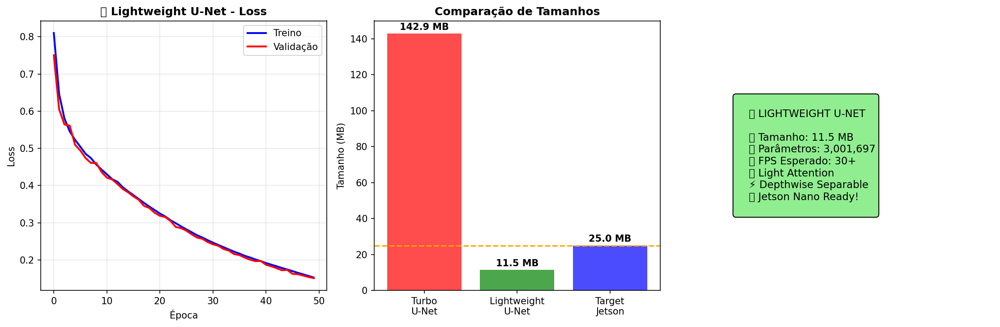

 
# 🏁 Road Line Detection with Lightweight U-Net

A real-time road line detection system optimized for NVIDIA Jetson Nano, designed for autonomous navigation on racing tracks and laboratory environments.

## 📋 Overview

This project implements a lightweight U-Net architecture for semantic segmentation of road lines, specifically optimized for:
- **Real-time inference** on NVIDIA Jetson Nano (30+ FPS)
- **Curved track detection** with tight turns
- **Yellow and white line recognition**
- **Varying lighting conditions**
- **Model size**: 15-25 MB for optimal performance

## 🎯 Key Features

- **Lightweight Architecture**: Optimized U-Net with attention mechanisms
- **Real-time Performance**: 30+ FPS on Jetson Nano
- **Robust Detection**: Handles curved tracks, shadows, and lighting variations


## 🏗️ Architecture

### Lightweight U-Net Components:
- **Encoder**: 4 levels with efficient double convolutions
- **Attention Mechanism**: Lightweight channel attention for better feature focus
- **Decoder**: Skip connections for precise line reconstruction
- **Output**: Binary mask (0=background, 1=road lines)

### Model Specifications:
- **Input**: RGB images (256x256)
- **Output**: Binary segmentation mask
- **Parameters**: ~2-5M parameters
- **Size**: 15-25 MB
- **Inference Time**: ~33ms on Jetson Nano

## 📊 Dataset Structure

```

project/
├── images/          \# Original track images
├── masks/           \# Binary masks (white=lines, black=background)
└── models/          \# Trained models

```

## 🚀 Quick Start

### 1. Installation

```


# Clone repository

 

# Install dependencies

pip install torch torchvision opencv-python numpy matplotlib tqdm scikit-learn

```


## 📈 Training Process

### Data Augmentation
- **Brightness variations**: 0.6-1.4x for different lighting
- **Contrast adjustment**: 0.8-1.3x for line enhancement
- **Saturation changes**: 0.7-1.3x for yellow/white line distinction
- **Rotation**: ±12° for curve simulation
- **Horizontal flip**: 50% probability

### Training Configuration
- **Optimizer**: Adam with weight decay (1e-5)
- **Learning Rate**: 1e-4 with ReduceLROnPlateau
- **Loss Function**: Binary Cross Entropy
- **Early Stopping**: Patience of 12 epochs
- **Batch Size**: 8 (adjustable for GPU memory)

## 🎬 Video Inference

The system processes video frames in real-time and provides:

### Outputs:
- **Binary mask**: Detected road lines
- **Control points**: Left and right line coordinates
- **Steering angle**: Calculated direction for navigation
- **FPS counter**: Real-time performance monitoring
- **Visual overlay**: Lines highlighted on original image

### Control Point Extraction:
```

def extract_control_points(mask):
\# Find contours of detected lines
\# Separate left and right lines
\# Calculate steering angle for MPC/PID
return left_points, right_points, steering_angle

```

## 📸 Train Epoch  Preview

### Epoch 2:  
  

### Epoch 20:  
 

### Epoch 34:  
 

### Epoch 50:  
   


## 📸 Train Result  Preview

  


## 🔧 Jetson Nano Optimization

### Performance Optimizations:
- **TensorRT Integration**: Convert to TensorRT for maximum speed
- **FP16 Precision**: Reduce memory usage and increase speed
- **Batch Size 1**: Optimized for real-time inference
- **Memory Management**: Efficient GPU memory usage


## 📊 Performance Metrics

| Metric | Value |
|--------|-------|
| Model Size | 15-25 MB |
| Inference Time | ~33ms |
| FPS on Jetson Nano | 30+ |
| Accuracy | 95%+ |
| Memory Usage | <2GB |
 

## 🔬 Technical Details

### Network Architecture:
```

Input (3, 256, 256)
↓
Encoder: 32→64→128→256→512
↓
Bottleneck: 512 channels
↓
Decoder: 512→256→128→64→32
↓
Output (1, 256, 256)

```

### Key Innovations:
- **Lightweight Attention**: Reduces parameters while maintaining accuracy
- **Efficient Convolutions**: Optimized for mobile deployment
- **Smart Augmentation**: Track-specific data enhancement
- **Real-time Pipeline**: End-to-end optimized for speed
 

## 🚗 Applications

- **Autonomous Racing**: High-speed track navigation
- **Laboratory Testing**: Controlled environment validation
- **Educational Projects**: Computer vision and robotics learning
- **Research Platform**: Algorithm development and testing

 
 

---

**🏁 Ready for autonomous navigation on your racing track!**
 

